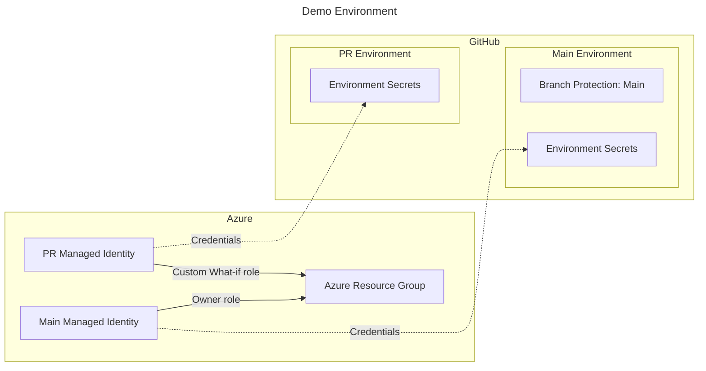

# Bicep Deploy What-If Without Write Permissions Demo

## Background

Since I started using ARM templates, and later Bicep, for infrastructure as code more than 5 years ago there has been [a filed issue](https://github.com/Azure/arm-template-whatif/issues/135) for being able to do ["what-if" deployments](https://learn.microsoft.com/en-us/azure/azure-resource-manager/bicep/deploy-what-if?tabs=azure-powershell%2CCLI) without requiring write permissions.

### Why is this a problem?
For people with previous experience with Terraform (including myself) being able to do a *plan* or a form of dry-run of a deployment in a PR before merging to main is often a desired pattern. This also applies to developers running their dry-runs locally. To be able to do this securely it's definetively a requirement that the PR branch or local developer environment does not actually have write access to your production deployment environment.

### Finally a possible solution?

So, after 5+ years of not much development I recently learned in the [latest Bicep community call](https://www.youtube.com/watch?v=WxdNrbSCEnw) that there actually was a recent feature released to support this. The only "official" news I've seen of this is the ambigious [changelog entry from Azure Powershell](https://github.com/Azure/azure-powershell/blob/main/ChangeLog.md#azresources-7100):

> - Added ValidationLevel Parameter to WhatIf and Validate cmdlets for deployments

for Az.Resources 7.10. If we dig into the documentation for the new parameter we see

> -ValidationLevel
>
> Sets the validation level for validate/what-if. ValidationLevel can be Template(Skips provider validation), Provider(Performs full validation), or **ProviderNoRbac(Performs full validation using RBAC read checks instead of RBAC write checks for provider validation)**.

Since there is few examples of using this and it's not very well documented elsewhere in the [what-if documentation](https://learn.microsoft.com/en-us/azure/azure-resource-manager/bicep/deploy-what-if?tabs=azure-powershell%2CCLI) what permissions is needed and such - let's see how it works!

> [!NOTE]
> As of June 1st 2025 it's not released for Azure CLI (will be released [in the upcoming 2.74 according to MS](https://github.com/Azure/arm-template-whatif/issues/135#issuecomment-2920160715).)

## Demo setup

The following resources will be set up in this demo:

**Azure:**
- A resource group (for demo purposes, to scope the role assignments used)
- Two user-assigned managed identities - one with only Reader permissions and one with Contributor permissions
- A Custom RBAC role that is similar to the Reader role, but also has  `deployments/whatIf/action` and `deployments/validate/action`.

**GitHub:**
- A PR environment with environment secrets for the PR user-assigned identity
- A main environment with environment secrest for the deploy user-assigned identity, including branch protection to only allow the main branch.



After this is set up two separate workflows referring to the two environments will be used:

1. [pr-validate-yaml](./.github/workflows/pr-validate.yaml): triggers upon pull requests and runs a what-if resource group deployment against the Azure resource group
2. [main-deploy.yaml](./.github/workflows/main-deploy.yaml): triggers upon push to main branch and runs a resource group deployment against the Azure resource group

These workflows uses the [Azure/login](https://github.com/Azure/login) and [Azure/bicep-deploy](https://github.com/Azure/bicep-deploy) actions.

## Prerequisities

- An Azure Subscription with Owner permissions
- [PowerShell 7.x](https://learn.microsoft.com/en-us/powershell/scripting/install/installing-powershell)
- [Azure PowerShell](https://docs.microsoft.com/en-us/powershell/azure/install-az-ps) (Az) version 13.4.0 or newer (requires Az.Resources 7.10 or newer)!

## Usage

### 1. Initialize environment

To be able to set this up you need to [fork this repository](https://github.com/matsest/bicep-deploy-whatif-without-write-demo/fork), clone it and do the following steps from your own fork:

#### Azure

To set up the environment in your Azure subscription open a terminal locally and run:

```pwsh
Connect-AzAccount # Select the correct subscription after logging in

# Configure variables
$ghUserName = '<your github user name>'

# Deploy locally:
$deploy = New-AzSubscriptionDeployment -Name "demo-whatif-env" -Location norwayeast `
    -TemplateFile ./bicep/prereqs/main.bicep -ghUserName $ghUserName
```

Keep the terminal open after running the command to ensure we can use the outputs from the `$deploy` variable:

```powershell
$deploy.Outputs | ConvertTo-Json

{
  "subscriptionId": {
    "Type": "String",
    "Value": "<sub id>"
  },
  "tenantId": {
    "Type": "String",
    "Value": "<tenant id>"
  },
  "deployerClientId": {
    "Type": "String",
    "Value": "<client id>"
  },
  "prClientId": {
    "Type": "String",
    "Value": "<client id>"
  }
}
```

#### GitHub

1. Create two [environments](https://docs.github.com/en/actions/managing-workflow-runs-and-deployments/managing-deployments/managing-environments-for-deployment) with the following names:
    - `Azure`
    - `Azure-PR`

2. Create two [repo level secrets](https://docs.github.com/en/actions/security-for-github-actions/security-guides/using-secrets-in-github-actions#creating-secrets-for-a-repository) with the values for your Azure subscription and tenant:
    - `AZURE_SUBSCRIPTION_ID`
    - `ÀZURE_TENANT_ID`

3. For both environments create two [environment level secrets](https://docs.github.com/en/actions/security-for-github-actions/security-guides/using-secrets-in-github-actions#creating-secrets-for-an-environment) with the values for the two user-assigned managed identities:
    - `AZURE_CLIENT_ID`

> [!TIP]
> For steps 2 and 3 you can run the following with GitHub CLI if you have it installed and set up:
>
> ```powershell
> # Set repo level secrets - replace with your values!
> gh secret set AZURE_SUBSCRIPTION_ID --body $deploy.Outputs.subscriptionId.Value
> gh secret set AZURE_TENANT_ID --body $deploy.Outputs.tenantId.Value
>
> # Set environment level secrets - replace values!
> gh secret set AZURE_CLIENT_ID --body $deploy.Outputs.deployerClientId.Value --env Azure
> gh secret set AZURE_CLIENT_ID --body $deploy.Outputs.prClientId.Value --env Azure-PR
> ```

4. For the `Azure` environment:
    1. Select **Deployment branches and tags** and choose **Selected branches and tags**
    2. Only allow `main` with **Ref type** branch

This will ensure that we can only run actual deployments from the `main` :lock:

### 2. Run what-if

1. Create a new branch and edit the `allowedoutboundaddresses` parameter value in the [demo bicep file](./bicep/demo/main.bicep)
2. Save the edits, commit and push to a new remote branch
3. Create a pull request from the newly created branch to the `main` branch
4. Verify that the 'Azure what-if' workflow is running against the PR

You can also run this workflow manually using a workflow dispatch run.

> [!NOTE]
> Note that when running the 'Azure What-If' workflow it runs in the `Azure-PR` environment, which uses a managed identity which does not have write permissions.

### 3. Deploy

1. Merge the  pull request (or push a bicep change to `main`)
2. Verify that the 'Azure Deploy' workflow is running against the latest commit on the `main` branch

You can also run this workflow manually using a workflow dispatch run.

> [!NOTE]
> Note that when running the 'Azure Deploy' workflow it runs in the 'Azure' environment, which uses the managed identity with Contributor permissions.

## Clean up

Delete the resource group including the managed identities, their credentials and other created resources by running:

```powershell
Remove-AzResourceGroup -Name "demo-whatif-gh-rg"
```

## Considerations

- There are still other fundamental issues with what-if (noise, resource provider support nested modules limitations) that needs improvements before a Bicep what-if is really comparable to a Terraform Plan. Kudos to the Bicep team for pushing and doing a lot of improvements on this area!

- If you want to simulate the same what-if behavior when running locally or something else than [Azure/bicep-deploy](https://github.com/Azure/bicep-deploy) you will need to add the `-ValidationLevel ProviderNoRbac` argument to the deployment cmdlet (see [docs](https://learn.microsoft.com/en-us/powershell/module/az.resources/new-azresourcegroupdeployment?view=azps-14.0.0#-validationlevel) for `New-AzResourceGroupDeployment`).

## LICENSE

[MIT License](./LICENSE)